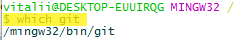
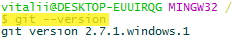
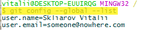
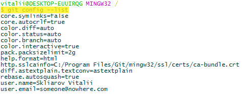
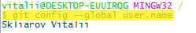
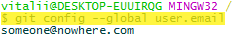
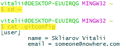
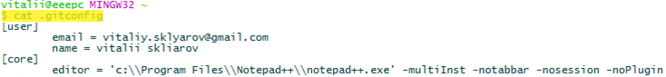

## 02 Установка git

Проверить где установлен git: **`which git`**

Проверить версию git: **`git --version`**

### Конфигурация git

Есть три места, где git хранит информацию о конфигурации (system-, user- и project-конфигурации):

- *System level configuration* – конфигурация применяется для всех пользователей на компьютере. Располагается в `Program Files\Git\etc\gitconfig`.

- *User level configuration* – конфигурация применяется для текущего пользователя на компьютере. Располагается в `$HOME\.gitconfig`.

- *Project configuration* – конфигурация применяется исключительно для конкретного проекта. Располагается в `my_project/.git/config`.

Чтобы установить настройки для конкретного уровня конфигурации применяется команда **`git config`**:

- для *system* с ключом `--system`: **`git config --system`**

- для *user* с ключом `--global`: **`git config --global`**

- для *project* с ключом `--local` или без него: **`git config`**

Например, указать имя пользователя git для текущего пользователя в системе: **`git config --global user.name "Skliarov Vitalii"`**

Указать почтовый адрес для текущего пользователя в системе: **`git config --global user.email "someone@nowhere.com"`**

Просмотреть существующие настройки для текущего пользователя в системе: **`git config --global --list`**

Просмотреть существующие настройки для всех уровней: **`git config --list`**

Просмотреть значение конкретного поля для текущего пользователя в системе (например, значение поля `user.name`): **`git config --global user.name`**

или (значение поля `user.email`): **`git config --global user.email`**

Перейти в домашнюю директорию и в ней же просмотреть содержимое файла конфигурации для текущего пользователя в системе:

Настройка использования редактора (для редактора Notepad\++ настройка использования выполняется командой):

**`git config --global core.editor "'c:\Program Files\Notepad++\notepad++.exe' -multiInst -notabbar -nosession -noPlugin"`**

В файле настроек это будет выглядеть следующим образом:

Настройка использования цветовой схемы (полю `color.ui` устанавливается значение `true`): **`git config --global color.ui true`**
