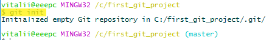
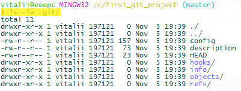
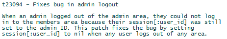
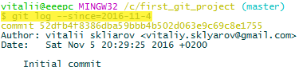
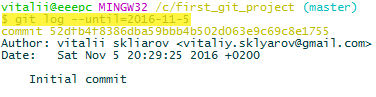
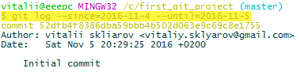
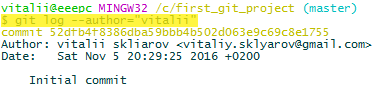
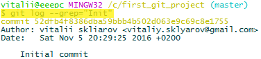

##Начинаем работу с git

###Инициализация репозитория

Инициализация репозитория в папке `C:/first_git_project`:

После инициализации репозитория создаётся пустой git проект с главной веткой `master`. С этого момента репозиторий git начинает отслеживать все файлы находящиеся в данной папке/подпапках.

Содержимое созданной папки репозитория:

###Написание сообщения коммита

Правила написания хороших сообщений для коммитов:
- Первая строка – краткое изложение (менее 50 символов).
- При необходимости, через пустую строку детальное описание (на каждую строку менее 72 символов).
- Сообщение коммита должно быть в настоящем времени (*present tense*), а не в прошедшем (*past tense*). Коммит должен отвечать на вопрос о том, что делает фиксируемое изменение, а не на то, что вы, как создатель, сделали. "*fix bug*" или "*fixes bug*", а не "*fixed bug*". – "Исправление ошибки...", а не "Исправил ошибку...".
- Может иметь перечисление (*bullet points*), которое может отмечаться с помощью звездочек (*asterisk*) или дефисов (*hyphen*).
- Может иметь "отслеживающий порядковый номер" из списка багов (или из отдела поддержки).
- Могут использоваться сокращения для организации изменений, например: "[css, js]" – для того чтобы отметить, что изменились конкретные файлы; "bugfix:" - для указания, что производились исправления ошибок; "#38405" - чтобы указать, что производилось конкретное исправление со своим порядковым номером.
- Быть понятным и описательным, например:
 - Плохое описание: "Исправлена опечатка" (*Fix typo*).
 - **_Хорошее описание_**: "Добавлен недостающий знак > в секции проекта HTML" (*Add missing > in project section of HTML*).
 - Плохое описание: "Обновлен код входа с систему" (*Update login code*).
 - **_Хорошее описание_**: "Изменена аутентификация пользователей с помощью Blowfish" (*Change user authentication to use Blowfish*).
 - Плохое описание: "Обновлен отчёт для участников, который необходимо обсудить, если будет собрание на следующей неделе" (*Updates member report, we should discuss if this is right next week*). – Такое описание плохое, так как оно будет существовать не один год, и будет запутывать читающих его.

Пример **_хорошего сообщения_** для коммита (сообщение описывает проблему и решение проблемы, что очень хорошо):

###Некоторые команды для работы с логом

Просмотреть сообщения коммитов: **`git log`**

Просмотреть определённое количество сообщений коммитов, начиная с последнего, например, один коммит: **`git log -n 1`**

Посмотреть сообщения коммитов после определенной даты (коммиты сделанные в указанную дату не попадут в вывод): **`git log --since=2016-11-4`**

Посмотреть сообщения до определённой даты (коммиты сделанные в указанную дату попадут в вывод): **`git log --until=2016-11-5`**

Также с помощью ключей **`--since`** и **`--until`** можно создавать диапазоны, например: **`git log --since=2016-11-4 --until=2016-11-5`**

Просмотреть сообщения коммитов только указанного автора (можно указывать неполное имя), например: **`git log --author='vitalii'`**

Можно использовать ключ **`–-grep`** (*global regular expression search*) чтобы указать выражение для поиска по сообщениям коммитов, например: **`git log --grep='Init'`**

