##Концепции и архитектура git

###Архитектура трёх деревьев

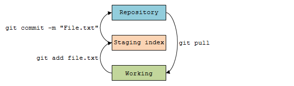

###Рабочий процесс git

Описание процессов иллюстрируемых архитектурой трёх деревьев.

**Добавление файла**

1) Представим, что мы добавили файл **file.txt** в рабочую область репозитория git (это директория отслеживаемая git). На данный момент состояние файла **file.txt** - версия 1. Теперь файл **file.txt** находится в секции "**Working**" и git обнаруживает пакет изменений связанный с добавлением файла **file.txt** (назовём этот пакет изменений **A**).

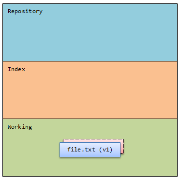

2) Командой **`git add file.txt`** передвигаем пакет изменений **A** в секцию "**Staging index**". Теперь в данной секции находится пакет изменений **A**, а с ним и файл (состояние файла) **file.txt** версии 1.

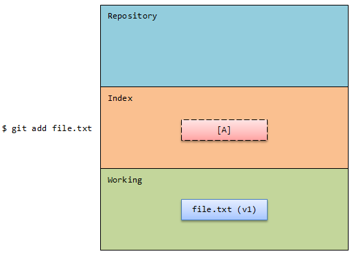

3) Командой **`git commit`** продвигаем пакет изменений **A** в секцию "**Repository**". Теперь в данной секции находится пакет изменений **A**, а с ним и файл (состояние файла) **file.txt** версии 1.

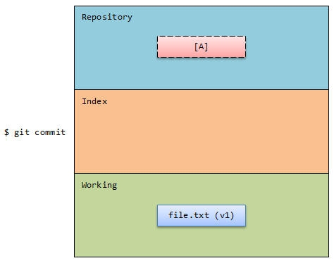

**Редактирование файла**

4) Представим, что мы отредактировали файл **file.txt**, теперь он стал версии 2. Разница между версиями 1 и 2 отображается в пакете изменений **B**. Итого, в секции "**Working**" находится файл **file.txt** версии 2 и пакет изменений **B**.

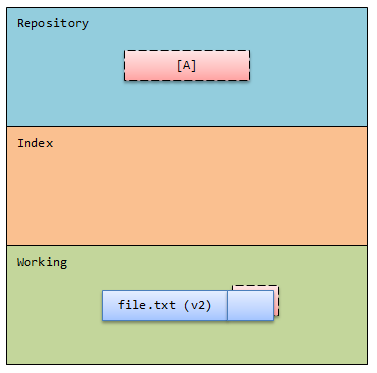

5) Командой **`git add file.txt`** закрепляем изменения, продвигая их в секцию "**Staging index**". Теперь в ней находится пакет изменений **B** отражающий разницу между файлом **file.txt** версии 1 и 2.

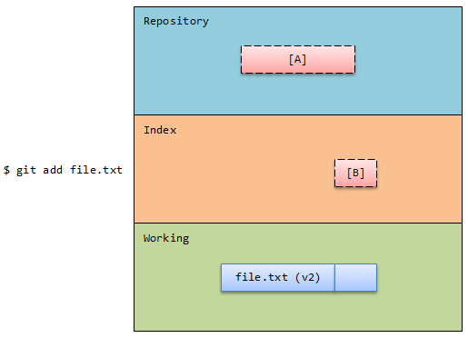

6) Командой **`git commit`** продвигаем пакет изменений **B** в секцию "**Repository**". Теперь в ней находятся пакеты изменений **A** и **B**, описывающие файл **file.txt** версии 2.

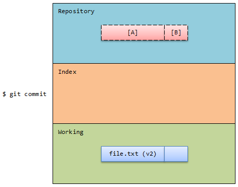

7) Представим, мы в файле **file.txt** сделали еще изменения, которые отобразились в пакете изменений **C**. Как и ранее, закрепляем пакет изменений командой **`git add file.txt`** и делаем коммит **`git commit`**. Теперь в секции "**Working**" находится файл **file.txt** версии 3, а в секции "**Repository**" находятся пакеты изменений **A**, **B** и **C** описывающие все изменения файла **file.txt** версии 3.

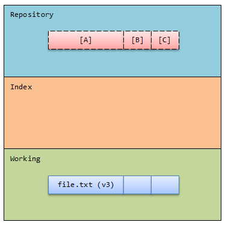

Если выполнить команду **`git log`**, то будут показаны пакеты изменений **A**, **B** и **C** с их сообщениями.

Важно понимать, что пакеты изменений **A**, **B** и **C** могут описывать изменения не только в одном файле, но и в нескольких файлах. Например, **A** описавыет добавление 5-ти файлов, **B** описывает изменения в трёх ранее добавленных файлах, а **C**, например, описывает изменения в ранее добавленном файле и добавление ещё двух новых файлов (или, например, удаление трёх ранее добавленных файлов).

###Пакеты изменений и их контрольные суммы

Git генерирует контрольную сумму (checksum) для каждого пакета изменений. Алгоритм создания контрольной суммы преобразует выполненные изменения в число. Одни и те же данные создают одну и ту же контрольную сумму. Целостность данных (data integrity) играет фундаментальную роль в git. Если данные изменяются, то изменяется и контрольная сумма. Git использует алгоритм SHA-1 для генерации контрольных сумм, которые представляют из себя строку длиной 40 шестнадцатеричных знаков (0-9, a-f).

Цепочка коммитов из вышеописанного рабочего процесса может выглядеть следующим образом:

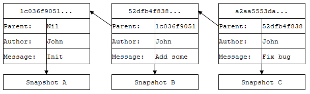

###Указатель HEAD

**HEAD** это переменная, указывающая на определённый (чаще последний) коммит в репозитории. Если сделать новый коммит, то **HEAD** начнёт указывать на новый (последний) коммит.

Можно говорить, что **HEAD**:

- указывает на "вершину" текущей ветки репозитория;

- указывает на последнее состояние репозитория;

- указывает на родителя следующего (будущего) коммита.

Если рассматривать пример изображённый на рисунке выше, то **HEAD** будет ссылаться на правый коммит (пакет изменений **C**) с контрольной суммой **a2aa5553a...**:

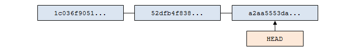

Представим процесс разработки по шагам. Например, у нас есть главная ветка **master** в которой только один коммит, - указатель **HEAD** ссылается на него:

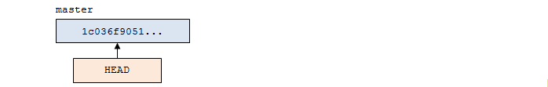

Делаем изменения, делаем коммит изменений, и получаем результат изображенный далее (**HEAD** указывает на новый коммит):

Делаем ещё одно изменение, делаем коммит, - **HEAD** перемещается на новый коммит:

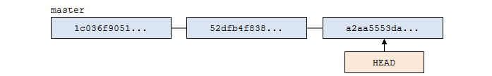

Представим, мы создаём новую ветку **new_branch** и переходим в неё. Теперь **HEAD** находится в новой ветке, но сейчас **HEAD** указывает на тот же коммит (так как структура проекта осталась такой же):

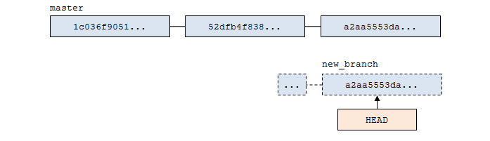

В ветке **new_branch** сделаем изменения и закоммитим их. Теперь **HEAD** указывает на новый коммит в ветке **new_branch**:

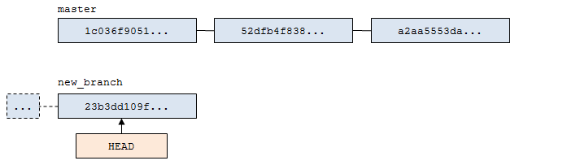

**_Примечание!_** Штриховой линией на рисунке выше отображаются коммиты ветки **master**, являющиеся общими с веткой **new_branch**.

Важно понимать, что при создании новой ветки (**new_branch**), коммиты ветки из которой создаётся новая ветка (**master**) не копируются в неё. В новой ветке (**new_branch**) будут храниться только *пакеты изменений* создаваемые в этой ветке.

Сделав еще изменения в ветке **new_branch** и закоммитив их, получим следующую структуру *пакетов изменений*, где **HEAD** указывает на верхушку (на последний коммит) ветки **new_branch**:

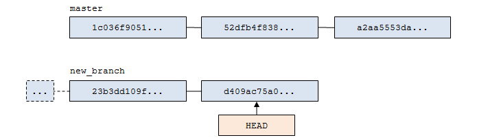

Теперь, если перейти в ветку **master**, то **HEAD** начнёт указывать на верхушку (на последний коммит) ветки **master**:

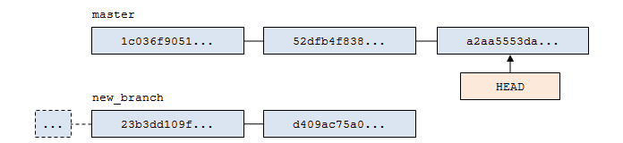

Итого: **HEAD** всегда указывает на верхушку текущей ветки (чаще всего верхушка ветки это последний коммит этой ветки, но не всегда).

Текущее значение указателя **HEAD** можно посмотреть в структуре каталогов репозитория git, - в папке ".git" находится файл **HEAD**:

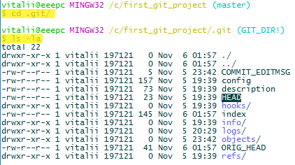

В этом файле записана некоторая ссылка на другой файл, имя которого совпадает с именем ветки в которой находится **HEAD**:

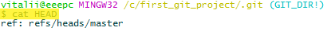

Содержимое файла (в данном случае `refs/heads/master`) - значение контрольной суммы *пакета изменений* на который указывает **HEAD** в проекте git:

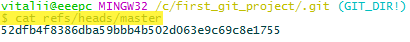

Если сравнить это значение со значением последнего коммита в проекте в ветке **master**, то они будут равны:

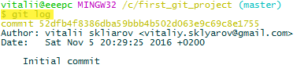

**_Примечание!_** Можно использовать команду **`git log`** в следующих вариациях: **`git log HEAD`** - показать цепочку *пакетов изменений* от ссылки **HEAD**, куда бы она не указывала; **`git log master`** - от верхушки ветки **master**, **`git log new_branch`** - от верхушки ветки **new_branch**.
