## 05 Как вносить изменения в файл

### Добавление файлов в репозиторий

Команда **`git status`** сообщает о разнице между рабочей директорией (**Working**), индексом (**Stage index**) и репозиторием (**Repository**). В данный момент рабочая директория "чистая" - в ней нет никаких изменений, которые обнаружил бы git:

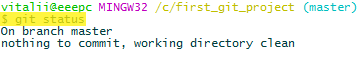

Добавив в рабочую директорию два новых файла, git сообщит о появлении неотслеживаемых файлов:

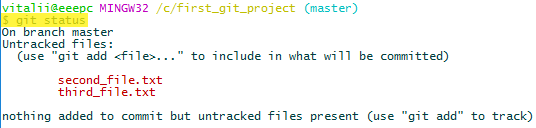

Если добавить файл **second_file.txt** в индекс (командой **`git add second_file.txt`**), то после этого git сообщит, что появились изменения требуемые фиксации/коммита (чтобы сохранить их в репозитории):

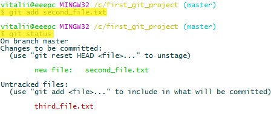

Также, git сообщает, что если необходимо отказаться от индексации изменений файла, то можно выполнить команду **`git reset HEAD <file>...`**, т.е., например, чтобы убрать изменения из индекса, относящиеся к файлу **second_file.txt**, - можно выполнить команду  **`git reset HEAD second_file.txt`**

Если сделать коммит, то git добавит в репозиторий изменения, которые были закреплены в индексе (изменения относящиеся к указанному файлу) и сообщит часть контрольной суммы с некоторой другой информаций:

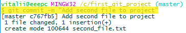

Теперь команда **`git status`** выводит другую информацию о состоянии (о разнице между рабочей директорией и репозиторием):

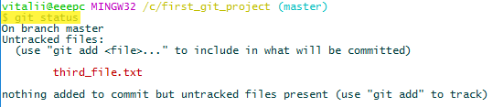

Для продолжения добавим изменения файла **third_file.txt** в индекс и сделаем коммит:

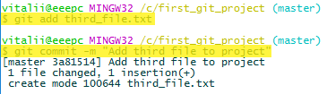

### Добавление изменений в репозиторий

Сделаем некоторые изменения в файле **first_file.txt**, после чего команда **`git status`** сообщит, что данный файл был модифицирован:

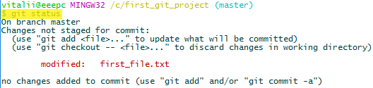

При помощи команды **`git add first_file.txt`** добавим в индекс изменения связанные с модификацией файла **first_file.txt**. Затем просмотрим статус git:

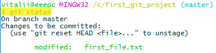

Git сообщает, что изменения файла **first_file.txt** находятся в индексе и, что эти изменения попадут в следующий коммит.

Теперь сделаем изменения в двух других файлах: в **secont_file.txt** и в **third_file.txt**. Git сообщит об этом (изменения первого файла находятся в индексе, а изменения двух других - протсо обнаружены - т.е. находятся в рабочей директории):

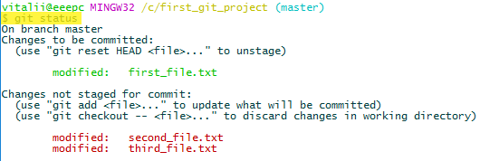

После добавления изменений второго файла в индекс, git сообщит об этом следующим образом:

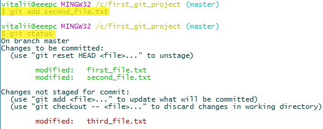

Сделаем коммит, чтобы сохранить изменения из индекса в репозиторий. В данном случае пакет изменений будет содержать в себе изменения двух файлов (**first_file.txt** и **secont_file.txt**):

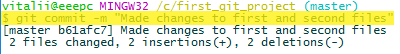

После, статус git сообщит, что изменения в третьем файле остались неиндексированными:

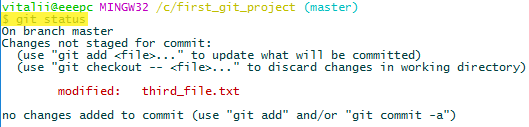

Для продолжения добавим изменения сделанные в третьем файле в индекс и закоммитим их:

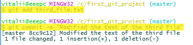

### Просмотр изменений между рабочей директорией и репозиторием

В Unix усть утилита **diff**, которая сравнивает два файла и показывает разницу между ними. Команда **`git diff`** показывает изменения в рабочей директории, сравнивая файлы рабочей директории с файлами сохранёнными в репозитории.

Сделаем некоторые изменения в файле **first_file.txt** и выполним команду **`git diff`**. Git покажет участок текста с удалённой строкой и тремя добавленными строками:

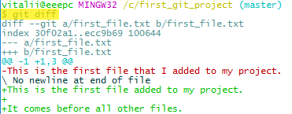

Сделаем еще изменения, но теперь в файле **third_file.txt**. Сейчас **`git diff`** показывает участки с удалёнными строками и добавленными строками двух файлов:

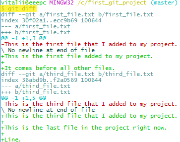

Чтобы просмотреть изменения только в одном конкретном файле, например в **third_file.txt** – необходимо выполнить команду **`git diff third_file.txt`**:

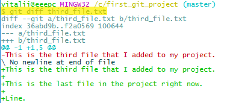

### Просмотр изменений между индексом и репозиторием

На прошлом шаге файлы **first_file.txt** и **first_file.txt** были модифицированы. Добавим изменения файла **first_file.txt** в индекс. Теперь при выполнении команды **`git diff`** будут показаны только те изменения, которые сделаны в файле **third_file.txt**, так как данная команда показывает изменения находящиеся только в рабочей директории (разницу между рабочей директорией и репозиторием):

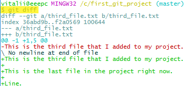

Чтобы просмотреть изменения находящиеся в индексе (разницу между индексом и репозиторием), необходимо воспользоваться ключом **`--staged`** (или **`--cached`**), выполнив команду **`git diff --staged`**::

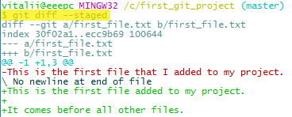

Теперь, если и файл **third_file.txt** добавить в индекс:

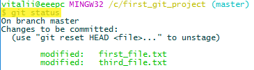

то команда **`git diff`** ничего не покажет:

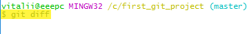

но, команда **`git diff --staged`** или **`git diff --cached`**, покажет изменения двух файлов, находящиеся в индексе:

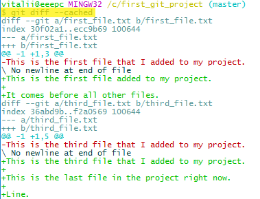

### Удаление файла из репозитория git

Для начала, сделаем коммит, чтобы изменения из файлов **first_file.txt** и **third_file.txt** сохранились в репозитории:

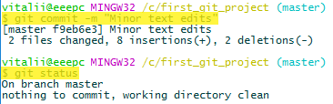

Создадим в рабочей директории два новых файла: **file_to_delete_1.txt** и **file_to_delete_2.txt**. Команда **`git status`** покажет два неиндексированных/неотслеживаемых файла:

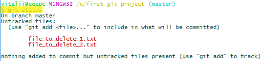

Если сейчас удалить эти файлы, то git перестанет показывать, что в рабочей директории находятся неотслеживаемые файлы.

Добавим изменения этих файлов в репозиторий (зафиксируем, добавив в индекс и сделаем коммит).

Существует два способа удаления файла/файлов из репозитория.

**I. Первый способ удаления файла** из репозитория заключается в простом удалении его из рабочей папки/директории. Удалим файл **file_to_delete_1.txt** в корзину, после чего команда **`git status`** покажет следующее:

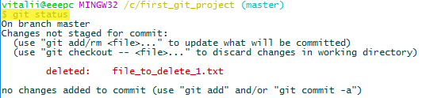

Git сверяет рабочую директорию и репозиторий, и сообщает, что он больше не находит в рабочей директории файл **file_to_delete_1.txt**, что он был удалён (статус файла - deleted).

Далее необходимо выполнить команду **`git rm file_to_delete_1.txt`**, это удалит файл **file_to_delete_1.txt** из репозитория:

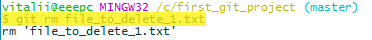

Теперь команда **`git status`** покажет следующее:

Git говорит, что пакет изменений заключающийся в удалении файла **file_to_delete_1.txt** находятся в отслеживаемом индексе и, чтобы сохранить эти изменения в репозитории, необходимо сделать коммит.

Делаем коммит для обновления репозитория:

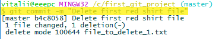

Git сообщает, что 1 файл изменён, а именно - удалён.

Теперь статус git показывает что рабочая директория чистая (нет никаких изменений):

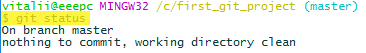

**II. Второй способ удаления файла** из репозитория - сразу выполнить команду **`git rm file_to_delete_2.txt`**. Но, важно осознавать, что при таком способе файл удаляется безвозвратно, он просто исчезает без перемещения в корзину.

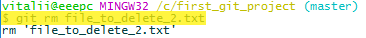

После удаления файла, статус git покажет, что пакет изменений связанный с удалением файла **file_to_delete_2.txt** уже присутствует в индексе:

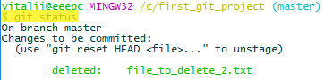

Теперь необходимо сделать коммит, для того чтобы изменения сохранились в репозитории:

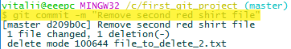

### Переименование файлов

Также как и при удалении файлов есть два способа переименования файлой: с помощью простого переименования и при помощи перемещения.

**I.** Рассмотрим **первый способ переименования**. Переименуем файл **first_file.txt** в **primary_file.txt** прямо в обозревателе файловой системы, и проверим статус репозитория командой **`git status`**:

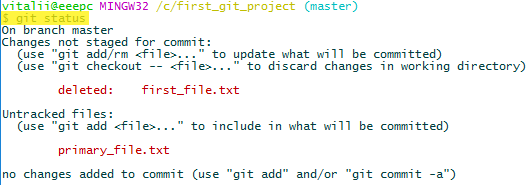

Git сообщает, что файл **first_file.txt** был удалён и, что появился неотслеживаемый файл **primary_file.txt**. Вот таким способом git видит переименование файла через обозреватель файловой системы.

Для внесения этих изменений в индекс, для **first_file.txt** необходимо выполнить команду **`git rm first_file.txt`**:

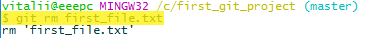

Сейчас статус git показывает следующее:

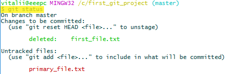

А для **primary_file.txt** необходимо выполнить команду **`git add primary_file.txt`**:

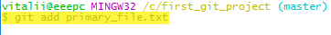

Теперь git может разобраться что к чему (путём сравнения содержимого файлов **first_file.txt** и **primary_file.txt**) и статус git покажет следующее:

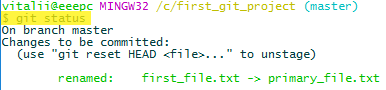

При этом, git поймёт, что это переименование, даже если файлы будут отличаться на 50% из-за того, что уже переименованный файл мог быть неким образом модифицирован.

**II. Второй способ переименования** заключается в команде **`git mv`**, например, чтобы переименовать файл **second_file.txt** на **secondary_file.txt**, необходимо выполнить команду **`git mv second_file.txt secondary_file.txt`**:

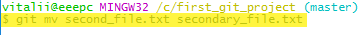

После выполнения данной команды статут git будет следующим:

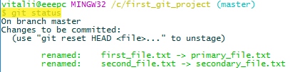

Как видно, git воспринял перемещение как переименование, что и необходимо.

### Перемещение файлов

Для примера создадим папку **first_folder** внутри рабочей директории и переместим в неё файл **third_file.txt** командой: **`git mv third_file.txt first_folder/third_file.txt`**:

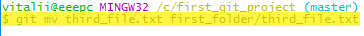

Вот и вся суть перемещения, хоть git это воспринимает как переименование файла с именем **third_file.txt** на файл с именем **first_folder/third_file.txt**:

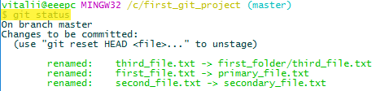

Для завершения сделаем коммит этих изменений, чтобы они сохранились в репозитории (при этом изменения трёх файлов окажутся в одном пакете изменений):

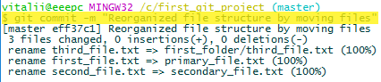
