## 06 Как использовать git в реальных проектах

В данной главе и далее для обучения используется проект "Explore California". Файлы проекта можно просмотреть/скачать по [ссылке](https://github.com/kevinskoglund/explore_california).

### Инициализация репозитория, добавление файлов в репозиторий

Первым делом инициализируем git-репозиторий в рабочей директории проекта, выполнив команду **`git init`**.

На данный момент статус репозитория сообщит, что в рабочей директории присутствуют неотслеживаемые (untracked) файлы:

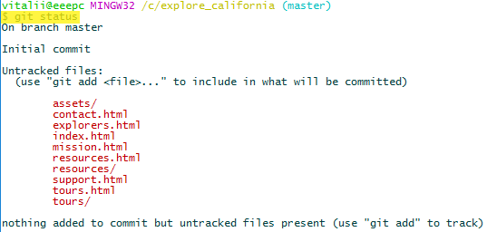

Если сейчас выполнить команду **`git log`**, то git выдаст ошибку. Это связано с тем, что на данный момент нет ни одного коммита. А так как в репозитории нет ни одного коммита, то и нет указателя **HEAD**, который указывал бы на последний коммит.

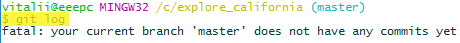

Командой **`git add .`** добавим все файлы проекта в индекс и сделаем коммит, выполнив команду **`git commit -m "Initial commit"`**. Это скопирует все файлы в репозиторий (сохранит в репозитории пакет изменений связанный с добавлением файлов).

После этого команда **`git log`** покажет сделанный, единственный коммит, являющийся вершиной (последним коммитом):

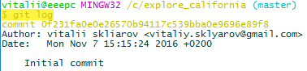

### Изменение одинаковой информации в нескольких файлах

Например, в файлах проекта, все упоминания номера телефона с окончанием **4315** заменим на **4314**. Сохраним изменения. Эти изменения появились в рабочей директории git:

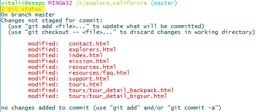

Команда **`git diff contact.html`** покажет места в коде где версия файла в репозитории отличается от версии файла в рабочей директории. В данном случае это два куска кода:

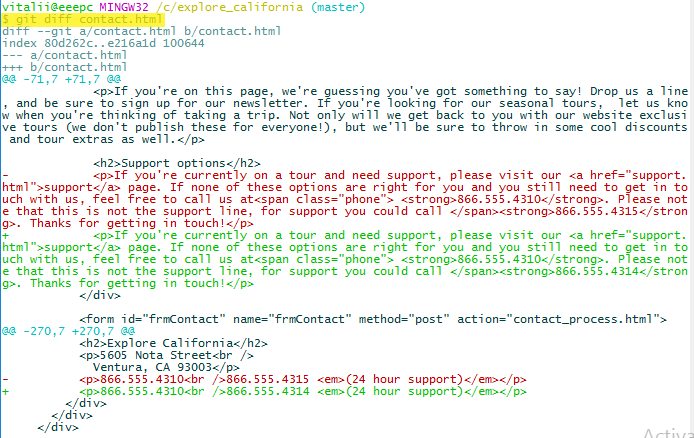

Предыдущая команда (**`git diff contact.html`**) с ключом **`--color-words`** подсветит изменения не "построчно", а "пословно":

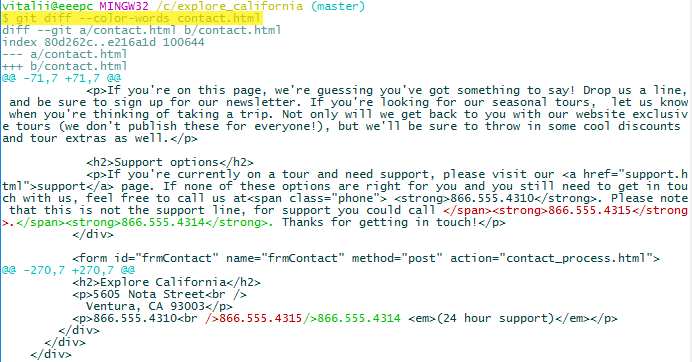

Чтобы зафиксировать изменения в индексе и сразу же перенести их в репозиторий, можно воспользоваться ключами **`-a`** и **`-m`** или **`-am`**, выполнив команду **`git commit -am "Commit message"`**. Но, такой способ добавления и фиксации изменений можно применить только для файлов со статусом "модифицированные", а не для файлов, которые только что были добавлены и их статус - "неотслеживаемые".

В данном случае производится добавление в индекс и фиксация в репозитории пакета изменений связанного с изменением номера телефона (в 10-ти файлах из примера выше):

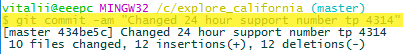

### Переименование файла, могущее затронуть содержимое других файлов

Переименуем файл **tours/tour_detail_backpack.html** в **tours/tour_detail_backpack_cal.html**:

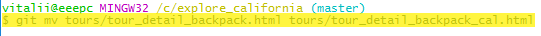

После переименования статус git покажет:

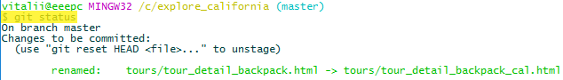

Далее, зменим в файлах все ссылки на переименованную html страницу. После редактирования ссылок статус git будет следующим:

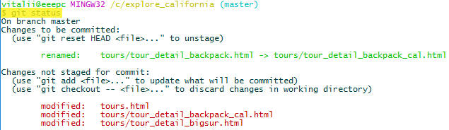

Добавим изменения модифицированных файлов в индекс. Вначале файл **tours.html**:

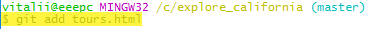

Затем файлы находящиеся в папке **tours**:

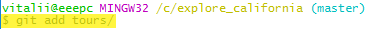

Теперь статус git выглядит следующим образом:

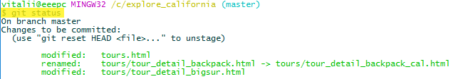

Заметим, что изменения в файле **tours/tour_detail_backpack.html** (изменение ссылки) не распознаются как нечто отдельное, git воспринимает этот файла как "переименованный", а не "модифицированный".

Представим, что дополнительно нам нужно изменить данные в файле **contact.html**. Делаем эти изменения и смотрим статус git:

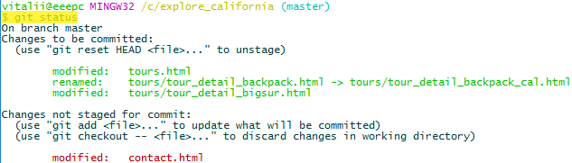

В такой ситуации лучше сделать два отдельных коммита: два разных действия - два разных коммита. Получится пакет изменений для действий связанных с изменением ссылки, и пакет изменений для действий связанных с редактированием содержимого файла **contact.html**.

Коммит для первого пакета изменений:

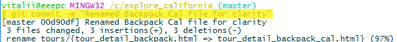

Коммит для второго пакета изменений:

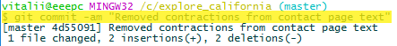
