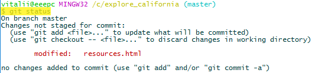
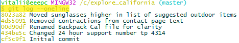

## 07 Отмена изменений

### Отмена изменений в рабочей директории

Сделаем некоторые изменения в файле **index.html**. Статус git покажет, что данный файл модифицирован:

Представим, что нам не нужно было делать эти изменения, а значит нужно вернуться к старой версии файла. Это можно сделать с помощью команды **`git checkout`**.

Обычно команда **`git checkout`** используется для работы с ветками. Она требует git выполнить следующее: "*Иди в репозиторий, возьми 'нечто' которое я тебе передал в параметрах, и сделай так, чтобы это 'нечто' в рабочей директории выглядело так же как выглядит это 'нечто' в репозитории*". Так что, если "нечто" это ветка, то git выполняет действия над веткой, а если файл – то над файлом.

Чтобы сказать git, что при выполнении команды **`git checkout`** мы хотим работать с файлом, нужно в данной команде поставить две черты, например: **`git checkout -- index.html`**. Это даст git подсказку, что мы хотим работать с файлом **index.html** в текущей ветке, а не с веткой **index.html**. Данной командой мы будто говорим git "*Пойди в репозиторий, в текущую ветку, посмотри как там выглядит файл **index.html** и сделай так, чтобы файл **index.html** в текущей директории выглядел так же*". Выполним эту команду и отменим изменения в указанном файле:

Теперь статус git покажет, что рабочая директория чистая, - она находится в таком же состоянии что и репозиторий:

### Отмена изменений в индексе

Для примера, сделаем некоторые изменения в файле **resources.html** и добавим их в индекс. Статус git:

Чтобы отменить изменения которые уже находятся в индексе, но при этом, чтобы они остались в рабочей директории, для файла **resources.html** необходимо выполнить команду **`git reset HEAD resources.html`**. Эта команда говорит git, чтобы он посмотрел на что указывает **HEAD** (а **HEAD** указывает на последний коммит в текущей ветке), и привёл состояние файла **resources.html** в индексе к такому, которое соответствует состоянию файла **resources.html** на момент последнего коммита.

Выполнение данной процедуры может понадобиться если вы по ошибке добавили в индекс несвязанные между собой изменения файлов, которые хотели бы разбить на два пакета изменений, сделав два коммита.

Выполним команду **`git reset HEAD resources.html`** и отменим добавление изменений в индекс:

Теперь git имеет следующий статус:

### Исправление последнего коммита

Закрепим в индексе изменения сделанные на прошлом шаге и добавим их в репозиторий.

Закрепляем:

Добавляем в репозиторий:

Теперь представим, что мы что-то недоделали, и необходимо добавить правки в пакет изменений входящий в последний коммит. Сделаем необходимые правки. Статус git покажет следующее:

Чтобы добавить сделанные правки в последний коммит, необходимо сначала закрепить их в индексе:

Статус git покажет, что изменения находятся в индексе:

А потом выполнить команду **`git commit`** с ключом  **`--amend`** и необходимым сообщением. Это позволит добавить новые изменения к последнему коммиту:

При этом, в данном случае, сообщение коммита оставлено такое же. Хотя, если сообщение коммита не нужно изменять, то можно воспользоваться командой **`git commit --amend`** без указания сообщения. Откроется редактор по умолчанию с уже введённым предыдущим сообщением.

Лог покажет, что у нас только один коммит с указанным сообщением, так что всё сработало как задумывалось и правки попали в последний коммит:

**Примечание!** Если необходимо изменить только сообщение последнего коммита, например, если в сообщении была допущена опечатка, то можно выполнить команду: **`git commit --amend -m "Новое сообщение"`** или просто **`git commit --amend`**, после чего будет открыт редактор по умолчанию со старым сообщением.

Например, изменение сообщения последнего коммита:

После изменения сообщения, git будет показывать следующий лог:

Как видим, сообщение "Rearrange the items to bring on a trip" было заменено на "Rearrange the items to bring on an outdoor trip".

**Примечание!** При исправлении последнего коммита меняется значение его контрольной суммы, так как она зависит, в том числе, и от сообщения коммита. Именно поэтому можно исправить (**amend**) только последний коммит, в противном случае нарушилась бы целостность данных представляющих дерево коммитов.

### Отмена изменений

Может произойти так, что внесённые изменения в проект оказались неправильными, и необходимо отменить эти изменения, при этом сохранив всё это в истории git, например как напоминание о том, как не нужно делать (подсказка, что данным способом проблему не рашить и т.п.).

**Первый способ отменить изменения** это вручную сделать изменения отменяющие предыдущие изменения и сделать новый коммит.

### Отмена изменений с помощью **`git checkout`**

**Второй способ отменить изменения** это отменить их с помощью git. Например, представим, что нам необходимо отменить изменения в файле **resources.html**, вошедшие в коммит "Rearrange the items to bring on an outdoor trip" с контрольной суммой **5625b5b...**, - вернувшись к состоянию файла **resources.html** такому, которое было на момент когда последним коммитом был коммит "Removed contractions from contact page text" с контрольной суммой **4d55091...**. Для этого необходимо выполнить команду: **`git checkout 4d55091 -- resources.html`**

После выполнения команды состояние файла **resources.html** изменится. В индексе его состояние станет таким, как было на момент коммита с контрольной суммой **4d55091...**. Статус git сообщает о том, что изменения файла **resources.html** находятся в индексе:

Если посмотреть разницу между индексом и репозиторием, то результат будет следующим:

Видно какие строки будут удалены, а какие добавлены – именно это и нужно сделать, чтобы файл принял первоначальное состояние (состояние перед реорганизацией списка).

Теперь если сделать коммит, то мы вернём состояние файла **resources.html** в репозитории к первоначальному. Для написания сообщения коммита, который устраняет некоторые изменения в другом коммите, хорошей практикой является указывать контрольную сумму устраняемого коммита.

Чтобы продолжить обучение, вернёмся к состоянию репозитория, которое было до начала отмены изменений.

Вначале выполним команду **`git reset HEAD resource.html`**, - это вернёт изменения из индекса в рабочую директорию:

Сейчас статус репозитория следующий:

И выполним команду **`git checkout -- resource.html`**, - это вернёт состояние файла **resource.html** в рабочей директории к такому же, как и в репозитории:

Теперь статус git покажет следующее (вернулись в состояние на момент начала урока):

### Отмена коммита

Чтобы отменить все изменения входящие к конкретный коммит, можно использовать команду **`git revert`**. Выполним команду **`git revert HASH`** (где **HASH** – контрольная сумма отменяемого коммита, в конкретном примере это последний коммит с контрольной суммой **5625b5b...**):

Во время выполнения команды **`git revert HASH`** откроется редактор по умолчанию с требованием ввести сообщение для создаваемого отменяющего коммита (можно оставить сообщение по умолчанию, созданное git, оно достаточно точно описывает проделываемое действие):

После этих действий рабочая директория и индекс остаются чистыми:

А лог git-а покажет новый коммит:

**Примечание!** Если делать **revert** не последнего коммита, а например, предпоследнего, то с большой вероятностью может возникнуть ошибка **revert**-a из-за возникшего конфликта между версиями файлов. Чтобы пройти путь без конфликтов, можно возвращаться по одному коммиту назад, хотя при этом каждый раз создаются новые коммиты (**revert**-коммиты). Но только если приемлемо возвращение по одному коммиту назад, так как это будет отменять каждый из коммитов. А при **revert**-е определённого коммита, через конфликт, можно добиться отмены изменений заключённых только в конкретном коммите.

### Отмена множества коммитов

Отменить множество коммитов (цепочку коммитов начиная от последнего) можно с помощью команды **`git revert`**. Эта команда переставляет указатель **HEAD** на требуемый коммит.

Обычно git самостоятельно управляет указателем **HEAD**, это происходит когда мы делаем коммит, в это время git переставляет указатель **HEAD** на новый/последний коммит. А командой **`git reset`** мы говорим git, что сами хотим управлять указателем **HEAD** и поставить его на определённый коммит.

У данной команды есть три ключа, которые управляют состоянием рабочей директории и индекса: ключ **`--soft`**, ключ **`--mixed`** и ключ **`--hard`**.

- Команда **`git reset --soft`** переставляет указатель **HEAD**, при этом не изменяя индекс и рабочую директорию.

- Команда **`git reset --mixed`**, передвигает указатель **HEAD**, при этом изменяет индекс, чтобы он соответствовал репозиторию, но не изменяет рабочую директорию. Ключ **`--mixed`** является ключом по умолчанию.

- Команда **`git reset --hard`** передвигает указатель **HEAD**, при этом изменяет индекс и рабочую директорию так, чтобы они соответствовали репозиторию.

**Примечание!** Перед выполнением команды **`git reset`** всегда рекомендуется сохранять контрольные суммы коммитов в текстовом виде, чтобы при необходимости можно было вернуть указатель **HEAD** на прежний коммит (или какой-либо другой коммит). Так как после перемещения указателя **HEAD**, при выполнении команды **`git log`**, коммиты за указателем **HEAD** больше не будут выводиться в лог.

#### Использование команды **`git reset --soft`**

Предположим нам необходимо вернуться к состоянию, которое было до выполнения команды **`git revert`** из урока выше. А именно, к состоянию когда последним коммитом был коммит "Rearrange the items to bring on an outdoor trip" с контрольной суммой **5625b5b...**:

Посмотрим, на какой коммит указывает **HEAD** сейчас:

Как видим, **HEAD** указывает на коммит с контрольной суммой **9e7110d39a408a14c62ce7c2d8feec42c8e296dc** – сейчас это верхушка дерева коммитов (он же последний созданный коммит).

Выполнив команду **`git reset --soft`** передвинем указатель **HEAD** на предпоследний коммит "Rearrange the items to bring on an outdoor trip" с контрольной суммой **5625b5b...**:

Как видим, теперь **HEAD** указывает на коммит с контрольной суммой **5625b5b...**:

И вывод команды **`git log --oneline`** также подтверждает, что верхушкой коммитов стал коммит с контрольной суммой **5625b5b...**:

**Замечание!** Как мы понимаем, сейчас верхушкой дерева коммитов является не самый последний из созданных коммитов, так что *верхушка дерева коммитов* и *последний коммит* не всегда тождественные понятия.

Статус git показывает, что последние изменения в фале **resource.html** присутствуют в индексе (но их уже нет в репозитории, - в репозитории состояние файлов такое, как было на момент коммита **5625b5b...**):

Если необходимо, командой **`git diff --staged`** можно просмотреть разницу между состояниями индекса и репозитория:

Если сейчас сделать коммит, то новый коммит станет верхушкой дерева коммитов в текущей ветке. Старый коммит "Revert 'Rearrange the items to bring on an outdoor trip'" с контрольной суммой **9e7110d...** станет "невидимым отростком" структуры дерева коммитов, став "альтернативной текущей веткой". *Невидимым отростком*, потому что, коммит **9e7110d...** останется существовать, но git не будет учитывает его при выводе структуры дерева коммитов/веток. *Альтернативной текущей веткой*, потому что, всё же можно переставить указатель **HEAD** на этот коммит, и тогда он снова станет верхушкой текущей ветки. [Детальнее.](explanation.md)

**Замечание!** Понятия *невидимый отросток* дерева коммитов и *альтернативная текущая ветка* неофициальные, они придуманы автором конспекта для попытки объяснения сути происходящего.

Вернём всё к первоначальному виду, переставив указатель **HEAD** на прежний коммит **9e7110d...**:

Лог git покажет следующее:

Статус git покажет, что рабочая директория чистая:

#### Использование команды **`git reser --mixed`**

Как и в прошлом уроке, предположим, что нам необходимо вернуться к состоянию когда последним коммитом был коммит "Rearrange the items to bring on an outdoor trip" с контрольной суммой **5625b5b...**:

После выполнении команды **`git reset`** с ключом **`--soft`** git ничего не выводил, а с ключом **`--mixed`** будет сообщать, что после выполнения команды появились неиндексированные изменения.

**M** от **modified**, модифицированный файл **resources.html**.

Статус git также покажет, что в файле **resources.html** присутствуют неиндексированные изменения:

Разница между рабочей директорией и репозиторием представлена результатом команды **`git diff`**:

Отличие между выполнением команды **`git reset`** с ключом **`--soft`** от выполнения с ключом **`--mixed`** незначительная, в первом случае изменения сохранены в двух местах (в рабочей директории и в индексе), а во втором случае – в одном месте (только в рабочей директории).

Продолжая дальше, вернёмся к коммиту "Revert 'Rearrange the items to bring on an outdoor trip'" с контрольной суммой **9e7110d...**, переставив на него указатель **HEAD**:

#### Использование команды **`git reser --hard`**

Как и в прошлых двух уроках, предположим, нам необходимо вернуться к состоянию когда последним коммитом был коммит "Rearrange the items to bring on an outdoor trip" с контрольной суммой **5625b5b...**.

Выполним команду **`git reset --hard`**, и сразу же получем сообщение о том, что указатель **HEAD** ссылается на коммит **5625b5b...**:

Лог git выводит ожидаемый результат:

А статус git, как видим, показывает, что рабочая директория и индекс чистые - без каких-либо изменений:

**Замечание!** При необходимости вернуться назад на прежний коммит, рекомендуется при выполнении команды **`git reset`** использовать тот же ключ, что и на предыдущем шаге.

Продолжая урок, немного отредактируем файл **resources.html**, сделав перестановку в списке, - это покажет команда **`git diff`**:

Сохраним изменения в индекс и сразу же в репозиторий:

Теперь лог покажет новую структуру коммитов, как видим, коммит "Revert 'Rearrange the items to bring on an outdoor trip'" с контрольной суммой **9e7110d...** не выводится:

**Замечание!** Выполнение команды **`git reset`** с ключом **`--soft`** или **`--mixed`** может понадобиться, например, для того чтобы добавить какие-то незначительные изменения к уже существующим изменениям и сохранить их все в одном пакете изменений (в новом коммите). А с ключом **`--hard`** - чтобы окончательно отказаться от существующих изменений и сделать новые.

### Удаление неотслеживаемых файлов

Представим, что в рабочей директории во время выполнения программы были созданы некоторые файлы (например, логи). Тогда, чтобы не удалять их вручную, можно воспользоваться командой **`git clean`**.

Для примера, создадим несколько файлов в рабочей директории. Статус git сообщит о них:

Сама по себе команда **`git clean`** ничего не сделает:

А команда **`git clean`** с ключём **`-n`** покажет, какие файлы будут удалены при очистке:

Добавим один файл в индекс, сделав его отслеживаемым, и посмотрим снова на результат команды **`git clean -n`**:

Теперь команда **`git clean`** намерена удалить только два файла. Так получается из-за того, что она удаляет только неотслеживаемые файлы.

Выполним команду **`git clean`** с ключом **`-f`** для удаления заявленных файлов:

Два файла удалены, один остался в индексе:

Теперь, если и первый файл не нужен, то его необходимо убрать из индекса и очистить рабочую директорию.

Удаляем из индекса:

Очищаем рабочую директорию:

Статус git сообщает, что рабочая директория чистая:

Можно убедиться, что этих файлов нет в рабочей директории:

**Примечание!** Команду **`git clean`** нужно использовать с осторожностью, так как удаляемые этой командой файлы никуда не перемещаются. Потом их нельзя будет восстановить. - Ни из репозитория, ни из индекса, ни из рабочей директории git, ни из рабочей директории проекта, ни из корзины. Они удаляются безвозвратно.
