##08 Игнорирование файлов

###Файл .gitignore

Файл **.gitignore** поддерживает простые регулярные выражения и отрицания. Например, строка **`*.php`** – указывает игнорировать любые **php**-файлы, а в дополнение к ней, строка **`!index.php`** – будет указывать не игнорировать файл **index.php**.

Чтобы указать, что некоторое название является не именем файла, а именем папки, после названия ставится слеш: **`assets/videos/`** - игнорировать всё содержимое подпапки **`videos/`** папки **`assets/`**.

Комментарии начинаются со знака шарп **`#`**, а пустые строки игнорируются.

Примеры:

|||
|--------|--------|
|**`tempfile.txt`**|Игнорировать файл **tempfile.txt**|
|**`.DS_Store`**|Игнорировать временные файлы MAC OS **.DS_Store**|
|**`*.zip`**|Игнорировать архивы **zip**|
|**`*.gz`**|Игнорировать архивы **gz**|
|**`log/*.log`**|Игнорировать лог-файлы в папке **log/**|
|**`log/*.log.[0-9]`**|Игнорировать лог-файлы с индексами от **0** до **9** в папке **log/**|
|**`assets/photoshop/`**|Игнорировать файлы в подпапке **photoshop/** папки **assets/**|
|**`assets/videos/`**|Игнорировать файлы в подпапке **videos/** папки **assets/**|
|**`!assets/videos/tour_*.mp4`**|Не игнорировать **mp4**-файлы с названием, состоящим из префикса **tour_** в подпапке **videos/** папки **assets/**|

При этом, правило **`log/*.log`** не будет игнорировать лог-файл **log/archive/acess.log**, так как оно действует только для файлов в папке **log/**, а не для файлов в подпапках папки **log/**.

###Соображения о том, что лучше игнорировать

Лучше игнорировать:

- **Файлы скомпилированного кода** – потому что эти файлы, по сути, не нужны проекту, ведь в репозитории находятся файлы нескомпилированного кода, из которых можно получить файлы скомпилированного кода.
- **Пакеты и сжатые файлы** – такие как, например, **zip-**, **gz-**, **iso**-файлы и т.п, потому что они не применяются непосредственно в проекте.
- **Лог-файлы и базы данных** – потому что это частоизменяемые файлы,  и их частое изменение будет загрязнять пакеты изменений в репозитории.
- **Файлы, генерируемые операционной системой** – потому что эти файлы не имеют никакого отношения к проекту.
- **Загружаемые пользователями файлы**.

По следующей [ссылке](https://help.github.com/articles/ignoring-files/) можно просмотреть более детальные советы о том, какие файлы лучше игноировать в ваших проектах. А по [ссылке](https://github.com/github/gitignore) можно скачать готовые **.gitignore** файлы для разных языком программирования и сред разработки.

###Глобально игнорируемые файлы

Плюсы глобального игнорирования файлов:

- Игнорирование файлов применяется ко всем репозиториям.
- Настройки игнорирования не сохраняются внутри репозитория.
- Пользовательская (глобальная) спецификация игнорирования файлов отделена от репозиториальной (локальной) специфики игнорирования файлов (например, может кто-то работает в Linux и ему всё равно, что вы игнорируете в Windows).

Но, важно понимать, что именно и как именно лучше игнорировать, например, игнорирование лог-файлов лучше настраивать локально, а не глобально. Так как при глобальной настройке игнорирования лог-файлов, у работающего с этим репозиторием на другой машине, будут создаваться лог-файлы, и они не будут игнорироваться из-за нелокальности настроек игнорирования.

Чтобы настроить глобальные правила игнорирования файлов, необходимо выполнить команду: **`git config --global core.excludesfile ~/.gitignore_global`**, настроив таким образом расположение файла глобального игнорирования, где:

**`--global`** – флаг, указывающий, что это глобальные настройки;

**`core.excludesfile`** – поле, которое хранит путь к файлу;

**`~/.gitignore_global`** – расположение файла **.gitignore_global** (имя может быть произвольное).

Создадим файл **.gitignore_global** в папке **C:/Users/vitalii/**, например, со следующим содержимым:

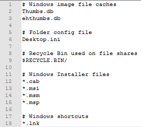

Выполним команду, которая в конфигурации git, укажет расположение созданного файла глобального игнорирования:

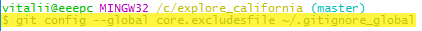

Если просмотреть файл настроек **.gitconfig**, то увидим новое поле (выделено):

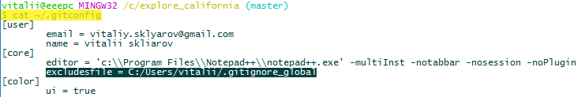

###Начало игнорирования отслеживаемых файлов (которые уже закоммичены)

Git не будет игнорировать файлы, которые уже отслеживаются. Так что, чтобы начать игнорировать закреплённый файл, его нужно "открепить".

Для демонстрации, добавим в рабочую директорию файл **tempfile2.txt** и начнём отслеживать его, добавив в индекс:

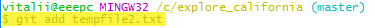

Далее, добавим его в репозиторий, закоммитив изменения связанные с добавление данного файла:

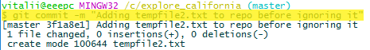

Через файл **.gitignore**, скажем git, что в будущем мы хотели бы игнорировать файл **tempfile2.txt**. После добавления строки в файл **.gitignore** об игнорировании файла **tempfile2.txt** статус git покажет, что он был изменён:

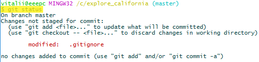

Но, если сейчас изменить файл **tempfile2.txt**, то статус git сообщит о его модификации - т.е. git не начал игнорировать его:

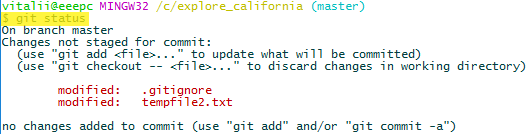

Чтобы сказать git, чтобы он прекратил отслеживать изменения в файле **tempfile2.txt**, можно удалить его из репозитория git, выполнив команду **`git rm tempfile2.txt`**. Но такой способ удалит файл **tempfile2.txt** из рабочей директории. А что если мы не хотим удалять его? - Тогда нужно с командой удаления использовать опцию **`--cached`**:

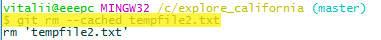

Теперь статус git покажет, что файл **tempfile2.txt** был удалён:

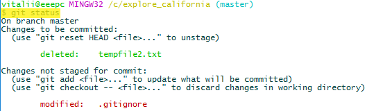

Добавим изменения, сделанные в **.gitignore** в индекс:

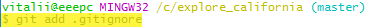

Статус git сообщит:

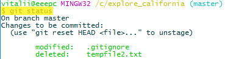

Сделаем коммит, чтобы перенести изменения в репозиторий:

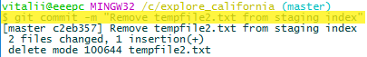

После этого статус git сообщит что рабочая директория чистая:

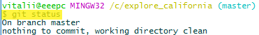

Файл **tempfile2.txt** остался в директории проекта, и если сейчас модифицировать его, то git будет игнорировать эти изменения, и статус git не изменится - рабочая директория будет оставаться "чистой".

###Отслеживание пустой папки

Тезисы об отслеживании файлов в git:

- Git спроектирован таким образом, чтобы отслеживать **файлы**, то есть:
 - git отслеживает файлы;
 - git отслеживает папки содержащие файлы (отслеживая эти файлы).
 - git игнорирует папки без файлов (пустые папки).

Но, если по какой-то причине в структуре проекта должна быть некоторая папка, которая на данный момент может быть пустой, то можно сделать так, чтобы git начал отслеживать эту "пустую" папку. Чтобы продемонстрировать это, создадим пустую папку в рабочей директории (в папке **assrts/** создадим пустую папка **pdfs/**):

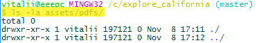

**`.`** – текущая директория;

**`..`** – ссылка на родительскую папку.

При этом, после создания папки **`pdfs/`**, git не начал отслеживать её:

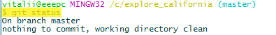

Для того чтобы git начал отслеживать данную папку в ней должны быть файлы. Например, можно создать в ней пустой файл **.gitignore** (чтобы поддерживать конвенцию в названии файла) или, как противоположность, создать пустой файл **.gitkeep**.

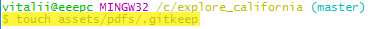

Содержимое папки **assets/pdfs/**:

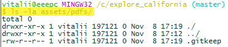

Статус git показывает, что появились неотслеживаемые изменения:

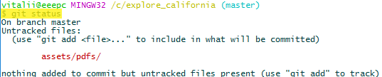

Добавим изменения в индекс:

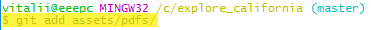

Git увидел новый файл и сообщает об этом:

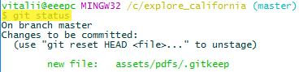

Теперь, сделав коммит, изменения можно добавить в репозиторий:

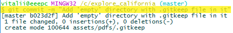

И статус git скажет, что рабочая директория чистая:

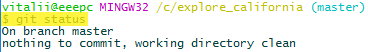
