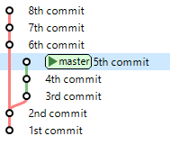

Визуально это можно продемонстрировать следующим образом.

Представим, у нас есть структура дерева коммитов состоящая из пяти коммитов. Результат команды **`git log`** следующий:

Мы передвинули указатель **HEAD** на второй коммит и сделали три новых коммита, после чего результат команды **`git log`** стал таким:

При этом, структура дерева коммитов, учитывая "невидимые коммиты", следующая:

Восьмой коммит является верхушкой текущей ветки (ветки **master**), а "отросток" с верхушкой из пятого коммита стал как-бы "альтернативной верхушкой" текущей ветки (ветки **master**).
Но всё же осталась возможность переставить указатель **HEAD** на пятый коммит:

После этого всё поменялось: восьмой коммит стал "альтернативной вершиной", отросток к нему стал невидимым; а пятый коммит стал врхушкой текущей ветки.
Теперь команда **`git log`** выводит первоначальную структуру дерева коммитов:

Можно даже сделать слияние получившихся веток (главной ветки и "альтернативной главной ветки"):

